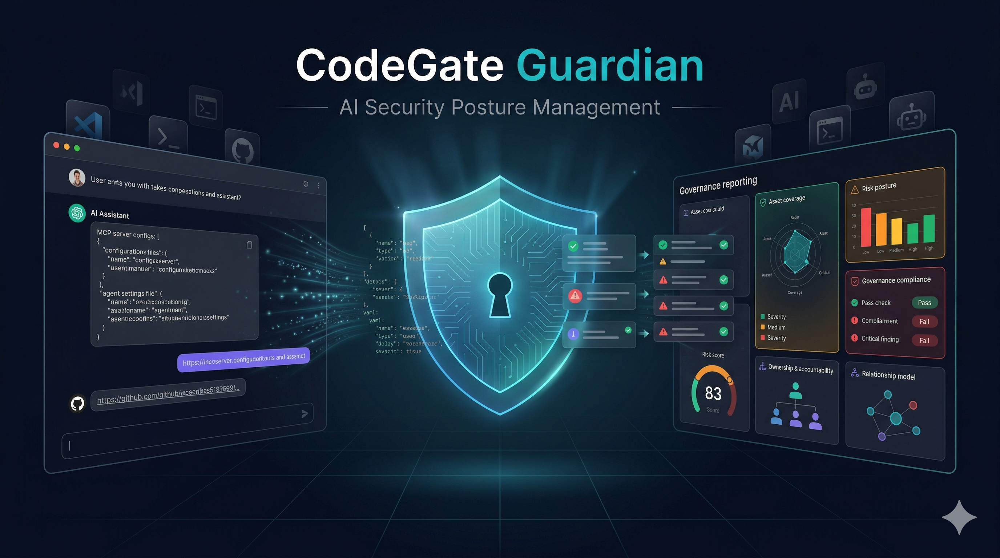

# CodeGate Guardian

CodeGate Guardian is an **AI Security Posture Management** and **AI Governance**
platform for engineering teams using AI coding tools.

It scans repositories and AI-tool configuration artifacts (skills, hooks, MCP
configs, IDE configs, rules, and agent instructions), converts findings into
structured security data, and presents report views for security and leadership
stakeholders.

## What This Platform Does

- Scans raw configuration content with `analyzeConfig`.
- Scans public GitHub repositories with `scanGithubRepo`.
- Detects `skills` automatically and applies skill-specific scanning flow.
- Stores normalized scan runs and findings in the database.
- Renders reporting focused on:
  - Asset coverage
  - Risk posture
  - Governance compliance
  - Ownership and accountability

## Scan Behavior

Repository scanning is intentionally deterministic:

1. Run repo scan first:
   `npx codegate-ai scan "<repo-or-path>" --force --format json --no-tui`
2. Detect skills in repository paths matching `*/skills/*/SKILL.md`.
3. If exactly one skill exists, auto-scan it with:
   `--skill <skill-name>`.
4. If multiple skills exist, return base findings and ask the user which skill
   to scan next (or `all`).

No `--deep` mode is used.

## Tech Stack

- Next.js App Router + React 19
- Vercel AI SDK for model/tool orchestration
- CodeGate scanner (`codegate-ai`)
- Drizzle ORM + Postgres
- Auth.js session/auth foundation
- Vercel Blob (file storage) and optional Redis stream support

## Prerequisites

- Node.js 20+
- pnpm 10+
- A Postgres database
- Vercel project (recommended for deployment parity)

## Environment Variables

Copy `.env.example` to `.env.local` and set values.

Required for most local development:

- `AUTH_SECRET`
- `POSTGRES_URL`

Required if you use AI Gateway outside Vercel:

- `AI_GATEWAY_API_KEY`

Gemini direct-key mode (recommended for Google models in local dev):

- `GOOGLE_GENERATIVE_AI_API_KEY` or `GEMINI_API_KEY`

Optional:

- `BLOB_READ_WRITE_TOKEN` (file/blob features)
- `REDIS_URL` (resumable stream behavior)
- `HACKATHON_MODE=true` (shared/global reporting view across guest sessions)

## Local Development

```bash
pnpm install
pnpm db:migrate
pnpm dev
```

App runs at [http://localhost:3000](http://localhost:3000).

## Development Commands

- `pnpm dev` - start local dev server
- `pnpm build` - run DB migration + production build
- `pnpm start` - run production build output
- `pnpm check` - run code quality checks (`ultracite check`)
- `pnpm fix` - auto-fix style/lint issues (`ultracite fix`)
- `pnpm test` - run Playwright E2E suite

Database utilities:

- `pnpm db:generate`
- `pnpm db:migrate`
- `pnpm db:studio`
- `pnpm db:push`
- `pnpm db:pull`
- `pnpm db:check`
- `pnpm db:up`

Useful targeted test commands:

```bash
# Unit tests
pnpm exec tsx --test tests/unit/*.test.ts

# Example: scan flow tests only
pnpm exec tsx --test tests/unit/scan-github-repo.test.ts
```

## Deploy to Vercel

Option 1 (recommended script):

```bash
pnpm deploy:prod
```

Option 2 (manual):

```bash
pnpm dlx vercel --prod --yes
```

Before deployment:

1. Ensure all required env vars are set in Vercel Project Settings.
2. Ensure AI Gateway is enabled if you are routing through gateway models.
3. Confirm database connectivity from Vercel runtime.

## Model Routing Notes

- Default model is `google/gemini-2.5-pro`.
- If `GOOGLE_GENERATIVE_AI_API_KEY` (or `GEMINI_API_KEY`) is present, Google
  models use direct Gemini provider.
- Otherwise, models are routed through AI Gateway.

## Project Intent

CodeGate Guardian is not a generic chatbot. The core deliverable is
**actionable AI security posture reporting** with scan evidence that maps to
governance outcomes and ownership decisions.
